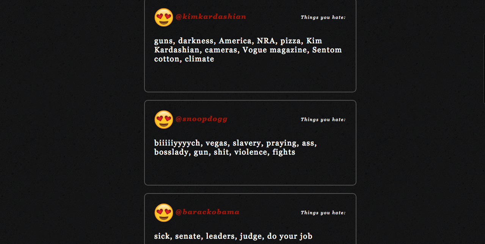

# Hater

'Cause Life is more fun when you're a HATER


## Err'Day A Hater 

** The App ** This app was inspired by the Voight-Kampff machine in Blade Runner, which is a sentiment analysis test to determine if a being is a human or replicant, based on their positive word assocations. The name is inspired by the album "Hater" by early 2000s, underrated, nu-metal band, Korn. 


## How It Works

The app uses a machine-learning sentiment analysis API to determine all the things a person hates based on their Twitter profile using natural language processing, text analysis and computational linguistics. 

The app renders a pretty word cloud to display all the words with a negative sentiment association. 

The user enters in a random Twitter handle and then they can see all the things the person "hates" based on their Twitter acount. The user can save their word list to the database, which keeps track of all the profiles they analyzed.

 

### Technologies Used to Build App
* React
* Node.JS
* JSX
* PostgreSQL
* Express.js
* Twitter API
* d3
* Diego opinion-mining API
* Javascript
* CSS

#### Partial Algorithm I wrote to parse sentiment analysis data into a word cloud

 ```Const results = res.data.data

    for (var key in results) {
      let total_words = [];
      if (key == "is negative about") {
        var myResults = results[key]
        const parsedWords = myResults.map((results)=>{
          const keys = Object.keys(results)
          return keys.map((key)=>{
            return {text: key, value: results[key]}
          })
        }).reduce(function(a, b) { return a.concat(b); }, []);
        this.setState({
             resultNegative: parsedWords,
             dataParsed: true
     }); 

     ```

     


